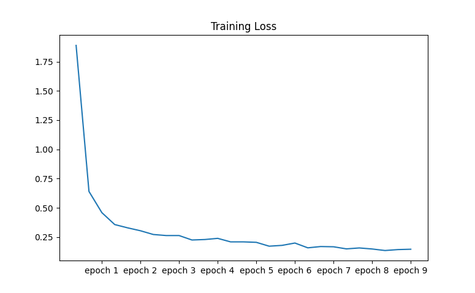

# Densely Connected Convolutional Neural Networks

## Introduction

Densely connected CNNs, or DenseNets, are a variation of simple CNNs where a particular layer's feature maps are used as inputs to all subsequent layers. Some inherent problems with conventional CNNs that this architecture aimed to solve were -

* Most deep neural networks have very long connections between the initial layers and the loss function. As a result the error gradient after going through multiple layers dies out before reaching the initial layers. This is known as the “Vanishing Gradient problem”. DenseNet aims to improve the propagation of errors throughout the network to increase the learning efficiency. 

* Conventional CNNs requires each layer to not only learn new features but also pass on features from previous layers forward. The features learnt in the initial layers are not used anywhere in the network ahead. This results in lower efficiency in the use of parameters. DenseNet aims to achieve the same level of learning as other prevalent architectures but with a fewer number of parameters.


Consider a single image x0 that is passed through a convolutional network. Each layer of the network implements a non-linear transformation H(.) which is a composite function of three consecutive operations - Batch Normalization, followed by ReLU activation and finally 3x3 convolution. Output of the Lth layer is denoted as xL.

The Lth layer receives the feature-maps of all preceding layers x0 , …. , xL as input: xL = H([ x0, x1, …. , x{L-1}]), where [x0, x1, …. , x{L-1}] refers to concatenation of the features maps produced in the previous layers. As a direct consequence of the input concatenation, the feature-maps learned by any of the DenseNet layers can be accessed by all subsequent layers. This encourages feature reuse throughout the network and leads to more compact models. 

The number of parameters in our model is found to be just 768648, which is lower than that of a normal CNN which ususally has tens of millions of parameters. The efficient use of parameters means that the model is less prone to overfitting.

Each function H produces k feature maps and hence the Lth layer has k0 + k(L - 1) input feature-maps, where k0 is the number of channels in input layer and k is known as the growth rate of the network.

Although each layer only produces k output feature maps, it typically has many more inputs. To reduce the number of parameters, a 1x1 convolution is introduced know as the bottleneck layer before each 3x3 convolution in the dense block This improves the computational efficiency of the model. In such a bottleneck layer, H comprises of BN-ReLU-Conv(1x1)-BN-ReLU-Conv(3x3). Each 1x1 convolution layer produces 4k feature maps.
 
To allow downsampling, the network is divided into multiple dense blocks where the feature size remain the same within each block. These dense blocks are each separated by a transition layers which do convolution and pooling. The transition layer used in Densenet consists of a batch normalization layer and a 1x1 convolutional layer followed by 2x2 average pooling layer.

The number of feature-maps at transition layers are reduced which improves the model compactness. If a dense block contains m feature maps, the following transition layer generate θm output feature maps, where 0<θ≤1 is referred to as the compression factor.

We will implement a DenseNet in PyTorch.  Open the terminal, navigate to the working directory and type the following:

```python train_test.py --epochs 9 --batchsize 10 --learningrate 0.01```

The command line arguments (epochs, batchsize and learningrate) are optional. These are their default values but can be changed to compare their effects on accuracy and computation time.

Running the scripts require PyTorch and a CUDA enabled GPU. If not installed, run:

```pip3 install torch==1.9.0+cu102 torchvision==0.10.0+cu102 torchaudio===0.9.0 -f https://download.pytorch.org/whl/torch_stable.html```

The results below were acheived using GPU acceleration with an NVIDIA GeForce GTX 1650 Ti.

## Dataset details

The dataset to be used is the Street View House Numbers (SVHN) dataset. It contains 73257 digits for training and 26032 digits for testing. There are 10 classes, 1 for each digit. The dataset file gives us a dictionary. The key X corresponds to a value of an array of dimensions 32x32x3x73257 for the train set. The array stores the 73257 RGB images of size 32x32 pixels. The key y corresponds to the labels for each image. For example, one of the images in the train set is displayed below.


## Creating the network architecture

Our network is 100 layers deep. Therefore, the number of layers in one dense block would be ((100 - 4)/3) / 2 = 16. We subtract the four extra layers, i.e. the initial conv, the two transitions, and the final classifier, and then divide by three to get per block. Another division by 2 because of two convolutions in the bottleneck block. This argument is passed to the DenseBlock class.

Now, we create the final architecture as - 

1. Initial convolution before entering any block

In Channels = 3, Out Channels = 2 * k = 24 
Out Feature Size = (32 - 3 + 2)/1 + 1 = 32

Below is the visualization of 9 out of the 24 feature maps that are concatenated and passed to the next transition block.


2. First dense block

In the bottleneck block,
In Channels = 24,  Out Channel = 4 * k = 48
Batch Normalization + ReLU -> No change in size
Out Feature Size = (32 - 1)/1 + 1 = 32

Therefore, for the total dense block,
In Channels = 48,  Out Channel = k = 12
Batch Normalization + ReLU -> No change in size
Out Feature Size after 1 layer = (32 - 3 + 2)/1 + 1 = 32
These 12 channels are concatenated with subsequent layers. The feature size remains same. There are 16 layers within each dense block. Therefore, at the end of the first dense block, number of out channels will be 24 + (12 * 16) = 216


3. First transition layer

Input feature dimension = 32 x 32 x 216
Out Channels = θ * L  = 0.5 * 216 = 108	
Out Feature Size due to avg pooling = (32, - 2) / 2 + 1 = 16
Therefore, output dimensions = 16 x 16 x 108


4. Second dense block


5. Second transition layer


6. Third dense block


7. Global average pooling and linear classifier

The global average pooling reduces the dimensions of the output of the third dense block. We flatten it and then pass it through a linear classifier, with input dimension as number of elements in flattened vector, i.e. 336 and output dimension as number of classes, i.e. 10. This is used to finally predict a label for the input image.

## Training and testing

Now, we have to train the model to optimize the parameters and minimize the loss using the following steps -

* We use the dataloader to load the train and test data. The dataloader is used to split the data in the dataset according to the batch size, and also optionally shuffle it. We iterate over the dataloader and fetch a different batch every time. There are 73257 images to train. We divide it into 7326 batches, each of size 10. 

* We get the input and the labels from the training data mini-batch and shift them to the GPU for faster computation.

* Now we pass our inputs to the model to get the output labels. We use cross entropy loss to calculate the error between the desired labels and predicted labels. The loss.backward() function is used to backpropagate the loss.

* The optimizer used is stochastic gradient descent. The optimizer takes the parameters of the densenet object (from densenet.parameters()) that we want to update, and modifies them in accordance to the learning rate using the optimizer.step() function. An optional argument, momentum, can be used to speed up convergence.

* We calculate the running loss for every 2000 mini-batches, and append their average to a loss vector.

Terminal screen after the script finishes running -


Training statistics -


The loss vs epoch graph is plotted below. Each epoch has three average losses per 2000 mini-batches. We see that the loss falls off very fast initially and then almost saturates. This shows that the major error correction happens in the first epoch itself, as is expected since the initial random weights and biases are very inaccurate. 



Now, in testing phase, we simply iterate over the data in the test dataloader and create the confusion matrix with predicted outputs and actual labels. The accuracy obtained on the test images is 95%. We also see tha precision and recall of all classes is very close to 1 which implies the presence of very few false positives and false negatives.


Note, in the heatmap of the confusion matrix, one of the highest misclassifications is for 1, 7 and 4, 1 but that is expected since the digits look somewhat similar.

